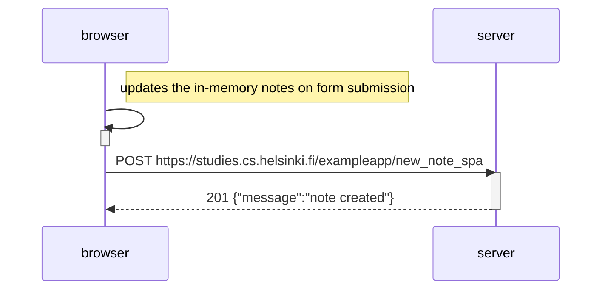

```mermaid
sequenceDiagram
    participant browser
    participant server

    note right of browser: updates the in-memory notes on form submission
    browser->>browser: 
    activate browser
    deactivate browser

    browser->>server: POST https://studies.cs.helsinki.fi/exampleapp/new_note_spa
    activate server
    server-->>browser: 201 {"message":"note created"}
    deactivate server
```
